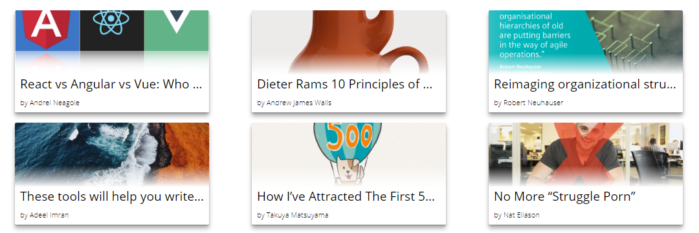

# Medium Claps

Reads the "has-recommended" RSS feed of a Medium user to HTML. Per default the posts are styled as cards. The scripts loads the last 10 posts the user has clapped on.
The RSS feed can be accessed via `https://medium.com/feed/@<username>/has-recommended`.

## Why?

I created this library for my personal page. I am currently learning more JavaScript and this was a nice little project I came up with to learn new things with JS, Parcel, npm, HTML and CSS. I am a big fan of the Medium platform, a paying member for a long time now and simply enjoy reading amazing articles there.

This project is not affiliated with **A Medium Corporation** and I am not earning any money with this. I am not responsible for applications that use this library.

## Usage

### HTML

Add the following HTML snippet to your website where you want the cards to show up. The cards are dynamically added to `#claps-container` later.
The template is used by the script to create the cards. You can modify the style if you want.

```html
<div id="claps-container">
    <template id="post-template">
        <a href="#{{postLink}}" class="post">
            <div class="post-container">
                <div class="post-details">
                    <div class="post-image" style="background: linear-gradient(transparent, transparent, transparent, #fff), url(#{{postImage}}) no-repeat center/cover;">
                    </div>
                    <div class="post-title">
                        <h2>#{{postTitle}}</h2>
                    </div>
                    <div class="post-author">
                        <p>by #{{postAuthor}}</p>
                    </div>
                </div>
            </div>
        </a>
    </template>
</div>
```

### CSS

Include `medium-claps.css` in your page. You can modify the styling as you want. If you change class names, make sure to adjust the HTML template accordingly.

This is the included default layout:



### JS

Medium Claps relies on [rss-parser](https://www.npmjs.com/package/rss-parser). Your web app should add `rss-parser` as a dependency directly.

Import `MediumClaps` in your javascript: 

```js
import { MediumClaps } from './medium-claps.js'
```

Now, you can simply initiate the rss parsing and DOM manipulation by creating a new `MediumClaps` object and passing in the config parameters.

For example:

```js
new MediumClaps({
    feedUrl: `https://your.crossorigin.proxy/get?url=${encodeURIComponent('https://medium.com/feed/@stephannielsen/has-recommended')}`,
    missingImage: 'https://source.unsplash.com/random/640x480',
});
```

Notes:

* Medium requires CORS, you can use a proxy like [allorigins.win](https://github.com/gnuns/allOrigins).
* Sometimes, a medium post has no image in the RSS feed. In this case, the script uses the image specified via the `missingImage` parameter. Here, a random image from [unsplash](https://unsplash.com).

The script will insert the cards into your `#claps-container` by default. You can specify a different container id as config parameter. You can also use a different template selector via the config.

All configuration parameters with defaults:

```js
config = {
    feedUrl: '',
    root: '#claps-container',
    template: '#post-template',
    missingImage: '',
}
```

## Development

### Get Started

1. Clone the repository.
2. Run `npm install`.
3. Configure CORS proxy in `main.js`.
4. Run `npm run dev` to start the development server on `localhost:1234`.
5. Run `npm run build` to bundle the JS for production with Parcel.